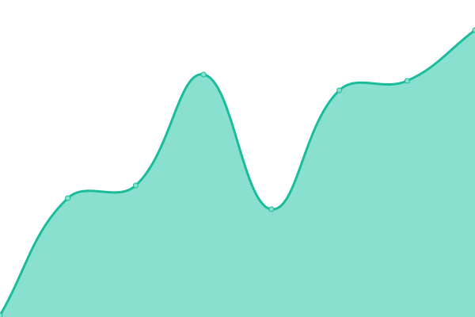

# [📈 Live Status](https://uptime.therealzzy.xyz): <!--live status--> **🟥 Complete outage**

<!--start: status pages-->
<!-- This summary is generated by Upptime (https://github.com/upptime/upptime) -->
<!-- Do not edit this manually, your changes will be overwritten -->
<!-- prettier-ignore -->
| URL | Status | History | Response Time | Uptime |
| --- | ------ | ------- | ------------- | ------ |
|  [Main Website](https://realzzy.xyz) | 🟥 Down | [main-website.yml](https://github.com/then77/web-uptime/commits/HEAD/history/main-website.yml) | 

 320ms
     
 | 

<a href="https://uptime.realzzy.xyz/history/main-website">83.01%</a>
    

|  [v2 Website](https://v2.realzzy.xyz) | 🟥 Down | [v2-website.yml](https://github.com/then77/web-uptime/commits/HEAD/history/v2-website.yml) | 

 250ms
     
 | 

<a href="https://uptime.realzzy.xyz/history/v2-website">83.42%</a>
    

|  [Old Website](https://v1.realzzy.xyz) | 🟥 Down | [old-website.yml](https://github.com/then77/web-uptime/commits/HEAD/history/old-website.yml) | 

 250ms
     
 | 

<a href="https://uptime.realzzy.xyz/history/old-website">83.66%</a>
    

<!--end: status pages-->

[**Visit the status website →**](https://uptime.therealzzy.xyz)

## 📄 License

- Powered by: [Upptime](https://github.com/upptime/upptime)
- Code: [MIT](./LICENSE) © [The N](https://therealzzy.xyz)
- Data in the `./history` directory: [Open Database License](https://opendatacommons.org/licenses/odbl/1-0/)
